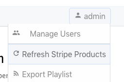
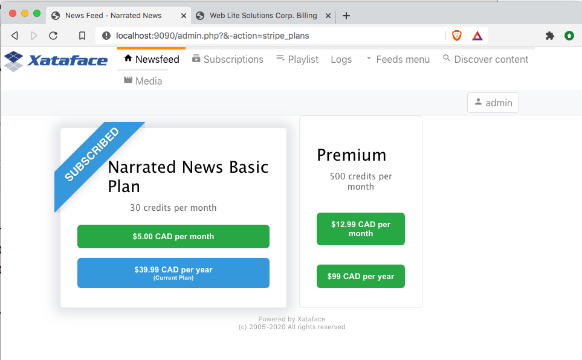
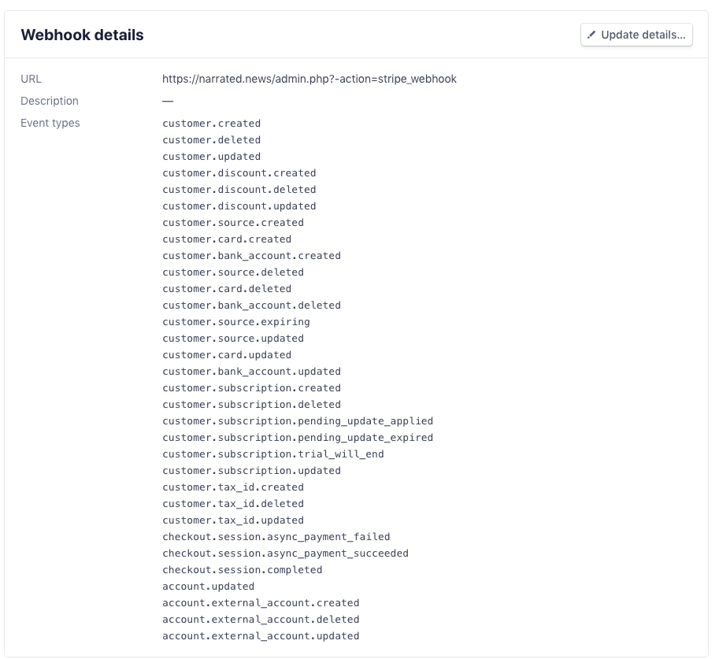
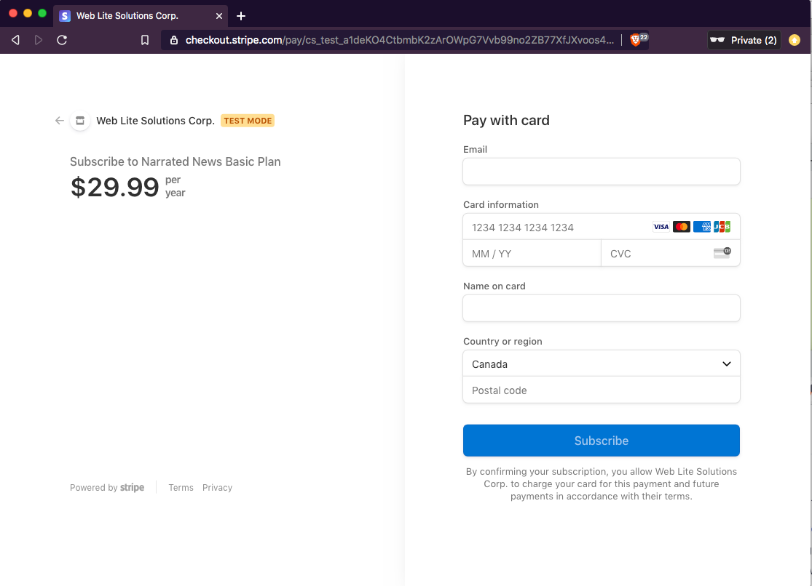
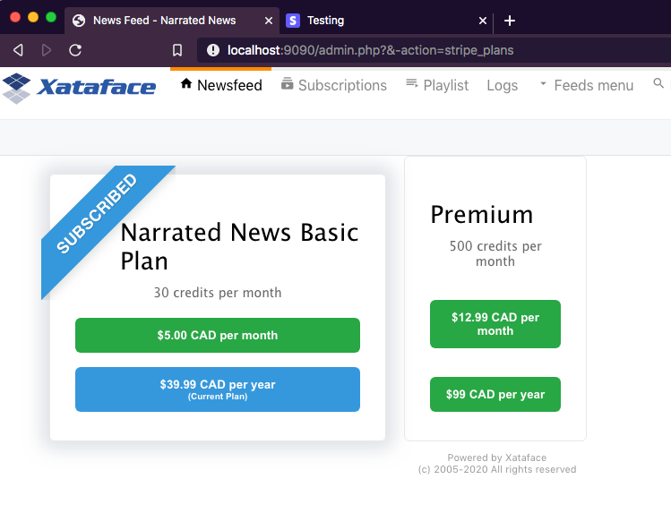
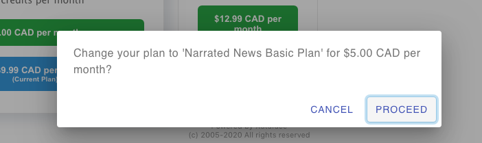
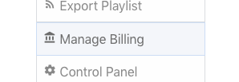
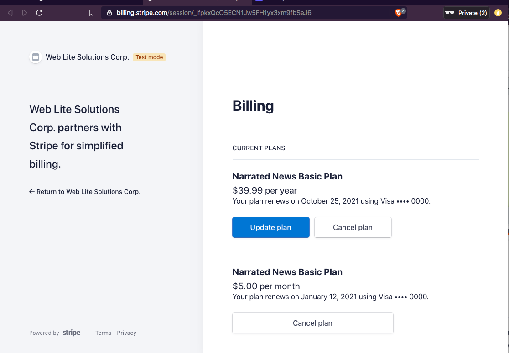

= Xataface Stripe Module

Support for https://stripe.com[Stripe] payments in http://xataface.com[Xataface]

== Synopsis

This module adds support for https://stripe.com[Stripe] payments in your http://xataface.com[Xataface] application.  While this module may be adapted to provide any type of workflow that requires payments, it is currently designed to support membership subscriptions, or something with a small number of products that can be purchased.  For example if you wanted to add different subscription levels to your application such as "Free", "Basic", and "Premium", this module would make it possible to use Stripe for the payments and maintenance of the different subscription levels.

== Prerequisites

. **Authentication**. The Stripe module requires that you have set up authentication in your application, so that you have a functioning "users" table.  This will allow it to map stripe customer IDs to your application's user accounts.
. **Stripe PHP SDK**.  Your application should install the https://github.com/stripe/stripe-php[Stripe PHP SDK dependency] via composer. E.g.
+
[source,bash]
----
composer require stripe/stripe-php
----

== Installation

. Download this module and copy it into your application's "modules/stripe" directory.
+
====
.E.g. Using git
[source,bash]
----
cd modules
git clone https://github.com/shannah/xataface-module-stripe stripe
----
====
. Add the stripe module to the "_modules" section of your conf.ini file:
+
[source,ini]
----
[_modules]
    modules_stripe=modules/stripe/stripe.php
----
. Add "stripe\__test" and "stripe_plans__test" sections to your app's conf.ini file.
+
====

NOTE: The "stripe\__test" and "stripe_plans__test" sections are designed to be used with your Stripe test data, and not your live stripe data.  Once you have your site working in test mode, you will copy these sections to "stripe" and "stripe_plans" sections respectively.  But it is important to be aware that your live stripe keys and plan IDs will be different than your test keys and plan IDs.

.Your app's conf.ini file.
[source,ini]
----
[stripe__test]
    stripe_secret_key = sk_test_XXXXXX 
    stripe_publishable_key = pk_test_XXXXXXXXXX 
    stripe_webhook_secret = whsec_XXXXXXX 
	success_action=YOUR_SUCCES_ACTION 
    
[stripe_plans__test]
    price_12345="$2.99 USD per month" 
    price_45678="$5.00 CAD per month"
    price_XXXX="$39.99 CAD per year"
    ...
----

**Properties**

stripe_secret_key::
Your Stripe secret key.  You can find this in your https://dashboard.stripe.com[stripe dashboard] in the "API Keys" section.  See https://stripe.com/docs/keys[Stripe's documentation] for information about their API keys.

stripe_publishable_key::
Your Stripe publishable key. You can find this in your https://dashboard.stripe.com[stripe dashboard] in the "API Keys" section.  See https://stripe.com/docs/keys[Stripe's documentation] for information about their API keys.

stripe_webhook_secret::
Your stripe webhook secret. You'll need to set up a webhook for Stripe to notify your app when relevant events take place.  See <<webhook>> for more information about this.

success_action::
The name of your "success" action.  This is an action that will be called when the user successfully purchases a plan.  See <<success-action>> for more information about this.

**The "stripe_plans__test" Section**

The properties in the "stripe_plans__test" section are all key/value pairs matching a stripe price ID with a label for the price.  The key is the price ID, and the value the label that will be displayed on the button to purchase the "price".  See https://stripe.com/docs/billing/prices-guide[Stripe's Products and Prices] documentation for more information about prices.  

====
. Implement `stripe_isSandbox()` in your application delegate class to return `true`.
+
====
There are two modes in stripe: 

1. Test Mode
2. Live Mode

You always need to be aware which mode your application is running in.  When your application is running in test mode, it will use the "stripe\__test" and "stripe_plans__test" sections of your conf.ini file for configuration.  These configuration settings should map to "test mode" data in your Stripe account.  

When in test mode, you cannot use real credit cards to make payments.  However, stripe provides a list of "fake" credit card numbers that you can use.  See https://stripe.com/docs/testing[Stripe's testing documentation] for a list of these credit cards, and more details about its test environment.

By default the Xataface stripe module will run in test mode when running on localhost, and live mode when running on any other domain.  You can override this behaviour by implementing the `stripe_isSandbox()` method in your application delegate class.

Here are some examples:

.Always in test mode
[source,php]
----
function stripe_isSandbox() {
    return true;
}
----

.Always in live mode
[source,php]
----
function stripe_isSandbox() {
    return false;
}
----

.In live mode if running on example.com.  Otherwise, in test mode.
[source,php]
----
function stripe_isSandbox() {
    return (@$_SERVER['HTTP_HOST'] == 'example.com');
}
----
====
. Implement "success action".  See <<success-action>> for more details about this step.
. Implement the stripe webhook.  See <<webhook>> for more details about this step.
. Run the "Refresh Stripe Products" action to import all of the products you have defined in your https://dashboard.stripe.com[Stripe dashboard] into your local database.
+

[#success-action]
=== Setting up Success Action

The general workflow for a stripe transaction is for the user to visit the `stripe_plans` action, where it will present the available plans that the user can subscribe to.

Then the user will click on one of the buttons to subscribe, and they'll be taken to the stripe payment form to enter their credit card information.  Upon successful payment, the stripe will direct the user back to your application's "success action".  Generally you'll want this action to display some informative message, thanking the user for subscribing.  

You can name this action anything you like, but you should reference it by the `success_action` directive in the `stripe__test` section of your conf.ini file.  Here is a sample action, that I have named `nn_stripe_success`:

.nn_stripe_success action defined in actions/nn_stripe_success.php
[source,php]
----
<?php
import('xf/core/XFException.php');
class actions_nn_stripe_success {
	function handle($params) {
		$user = getUser();
		if (!$user) {
			xf\core\XFException::throwPermissionDenied();
		}
		df_display([], 'narratednews/stripe_success_page.html');
	}
}
?>
----

Notice that this displays the template at narratednews/stripe_success_page.html.  The contents of that template are as follows:

.Success page template located at templates/narratednews/stripe_success_page.html
[source,html]
----
{use_macro file="Dataface_Main_Template.html"}
	{fill_slot name="main_section"}
		<h1>Your payment was successful</h1>
		
		{assign var=plan value=$ENV.user->val('plan')}
		{assign var=credits value=$ENV.user->val('credits')}
		
You now have {$credits->val('credits')} credits, and your plan is {$plan->val('plan_name')|escape}.

		
		
Your balance will be topped up to {$plan->val('credits')} credits on the {$credits->val('plan_renewal_day')}{$credits->val('plan_renewal_day_suffix')} day of each month.

		
		
You can update or cancel your plan at any time via the <a href="{$ENV.DATAFACE_SITE_HREF}?-action=stripe_customer_portal" target="_blank">secure customer portal</a>.
		If you cancel your plan, your plan will remain active until the end of your billing period, at which point your plan will automatically revert to a basic account, and your balance will be adjusted to the basic level of 5 credits.
		

		
		<h2>Where to go from here</h2>
		
		<ul>
			<li><a href="{$ENV.DATAFACE_SITE_HREF}?-action=xf_my_profile">View my account</a></li>
			<li><a href="{$ENV.DATAFACE_SITE_HREF}?-table=_tmp_newsfeed">View my news feed</a></li>
			<li><a href="{$ENV.DATAFACE_SITE_HREF}?-table=_tmp_nn_playlist">View my playlist</a></li>
			<li><a href="{$ENV.DATAFACE_SITE_HREF}?-table=_tmp_feed_catalog">Discover Content</a></li>
		</ul>
		
	{/fill_slot}
{/use_macro}
----

There are many aspects to this snippet that are proprietary to this application.  E.g. the "users" table of this application includes some calculated fields like "plan" and "credits" which keep track of which plan the user is currently subscribed to and how many credits they have.  These values are kept in sync using the webhook, which is called by Stripe after certain events occur.  See <<webhook>> for details on setting up the web hook.

[#webhook]
=== Setting up the Stripe Webhook

In order for this module to function correctly, you'll need to create a webhook in your https://dashboard.stripe.com[Stripe dashboard] for the `stripe_webhook` action in your application.  For example, if your application is hosted at http://example.com/index.php, then the endpoint you'll need to set up will be at "http://example.com/index.php?-action=stripe_webhook".

You'll want this webhook to receive "customer" and "checkout" event types.  The following is a screenshot of the webhook details for a sample application:

For more information about creating webhooks in Stripe see https://stripe.com/docs/webhooks[Receive event notifications with webooks] in Stripe's documentation section.

[TIP]
====
During development it is common to run your application on localhost, or somewhere that isn't accessible on the internet.  In such cases, you'll need to use the https://stripe.com/docs/stripe-cli[Stripe CLI] to receive the webhook events.  See https://stripe.com/docs/stripe-cli/webhooks[Listen to webhook events] in the Stripe CLI docs for details on how to set this up.

I set up this shell script to launch the CLI with my app's endpoint on my local machine, which is running my Xataface application on port 9090.

[source,bash]
----
#!/bin/bash
stripe listen --forward-to localhost:9090/admin.php?-action=stripe_webhook
----

====

==== Implementing the Webhook Callback

The `stripe_webhook` action will validate the the incoming webhook request from stripe, then it will update its internal tables with the information that it receives.  Then it will pass the event to the application delegate class' `stripe_webhook()` method.  If you don't implement this method, it will just skip this step, however, you'll most likely want to implement it so that you can respond to events like when the user subscribes to a plan, or cancels their plan.  

The signature for this method is:

[source,php]
----
function stripe_webhook(\Stripe\Event $event, Dataface_Record $record) {
    // ...
}
----

**Parameters**

`$event : \Stripe\Event`::
The https://stripe.com/docs/api/events/object[Event object] received from the https://stripe.com/docs/api?lang=php[Stripe PHP API].  

`$record : Dataface_Record`::
A record from the `stripe_transactions` table corresponding to this event.  The stripe_transactions table logs all events that are received through the webhook.  It stores things like the customer ID and JSON representations of the event data.

**What to do in the Webhook**

That most common thing you'll want to do inside your webhook callback is to update your user account details to reflect their current subscription levels.  For example, suppose users of your application receive a certain number of "credits" per month - a number that depends on their subscription level.

A very simple implementation of this credit system might have a "credits" column in the "users" table to keep track of the user's available credits.  In this case your webhook will want to respond to events like `customer.subscription.created`, `customer.subscription.updated`, and `customer.subscription.deleted` so that you can update the credits of the customer accordingly.

The following is a snippet from a sample application that implements the webhook:

.The stripe_webhook() method implemented in the application delegate class (conf/ApplicationDelegate.php).
[source,php]
----
function stripe_webhook(\Stripe\Event $event, Dataface_Record $record) {
	import(XFAPPROOT.'inc/stripeWebhook.func.php');
	nn\stripe\webhook\stripeWebhook($event, $record);
}
----

.inc/stripeWebhook.func.php
[source,php]
----
<?php
namespace nn\stripe\webhook;

use \Dataface_Record;
use \Exception;
use function \nn_info;
use function \nn_error;
use function \df_get_record;
use function \import;
use function \initUserCredits;

	
/**
 * Implementation of the ApplicationDelegate::stripe_webhook callback.  Refactored into separate file for performance.
 * @param \Stripe\Event $event The webhook event.  
 * @param Dataface_Record $record The stripe_transactions record.
 */
function stripeWebhook(\Stripe\Event $event, Dataface_Record $record) {
	$handler = new Handler($event, $record);
	$handler->run();
	
}

/**
 * Private implementation class for the stripe webhook that lets us break down the handling
 * of the webhook based on the type.
 */
class Handler {
	private $event;
	private $record;
	
	/**
	 * @type Dataface_Record[users]
	 */
	private $user;
	
	/**
	 * @type int (userid column of users table)
	 */
	private $userId;
	
	/**
	 * @type Dataface_Record[stripe_customers]
	 */
	private $customerRec;
	private $type;
	private $previous_attributes;
	private $object;
	private $canceled = true;
	
	/**
	 * @type \Dataface_Record from the subscription_plans table
	 */
	private $subscription_plan;

	
	function __construct(\Stripe\Event $event, Dataface_Record $record) {
		$this->event = $event;
		$this->record = $record;
		
		$type = $event['type'];
		if (strpos($type, 'customer.subscription.') !== 0) {
			//nn_error("Not customer subscription.  Found ".$type);
			return;
		}
		$this->type = $type;
	    $this->object = $event['data']['object'];
		$this->previous_attributes = [];
		if (@$event['data']['previous_attributes']) {
			$this->previous_attributes = $event['data']['previous_attributes'];
		}
		
	
	    $this->customer = @$this->object['customer'];
		if (!@$this->customer) {
			nn_error("No customer specified in webhook.  Data: ".json_encode($event), "#stripe_webhook");
			return;
		}
		for ($i=0; $i<5; $i++) {
			if ($this->customerRec) break;
			$this->customerRec = df_get_record('stripe_customers', ['customer_id' => '=' . $this->customer]);
			if (!$this->customerRec) {
				$customerRefId = @$event['data']['customer_reference_id'];
				if ($customerRefId) {
					$this->customerRec = new Dataface_Record('stripe_customers', []);
					$this->customerRec->setValues([
						'username' => $customerRefId,
						'customer_id' => $this->customer,
						'currency' => $data['items']['data'][0]['currency']
					]);
					try {
						$res = $this->customerRec->save();
						if (PEAR::isError($res)) {
							nn_error("Failed to insert stripe customer record. ".$res->getMessage().". Record vals: ".json_encode($this->customerRec->vals())."; Event data: ".json_encode($event), '#stripe_webhook');
							return;
						}
					
					} catch (\Exception $ex) {
						nn_error("Failed to insert stripe customer record. ".$ex->getMessage().". Record vals: ".json_encode($this->customerRec->vals())."; Event data: ".json_encode($event), '#stripe_webhook', $ex);
						return;
					}
				}
			
			}
			if (!$this->customerRec) {
				// Give the other webhooks a chance to possibly add the customer record
				sleep(1);
			}
		}
		
		if (!$this->customerRec) {
			nn_error("Failed to load customer record for customer ".$this->customer." in stripe_webhook.  Data: ".json_encode($event), "#stripe_webhook");
			return;
		}
	
		$this->user = df_get_record('users', ['username' => '=' . $this->customerRec->val('username')]);
		if (!$this->user) {
			nn_error("Failedto load userr ecord for customer ".$this->customer." username=".$this->customerRec->val('username').".  Data".json_encode($event), "#stripe_webhook");
			return;
		}
		$this->userId = $this->user->val('userid');
		$this->canceled = false;
	}
	
	
	function run() {
		if ($this->canceled) {
			return;
		}
		
		switch ($this->type) {
			case 'customer.subscription.created' :  return $this->subscription_created();
			case 'customer.subscription.updated' : return $this->subscription_updated();
			case 'customer.subscription.deleted' : return $this->subscription_deleted();
			case 'customer.subscription.trial_will_end' : return $this->subscription_trial_will_end();
		}
	}
	
	function subscription_created() {
		$transactionsDelegate = \Dataface_Table::loadTable('user_credit_transactions')->getDelegate();
		
		import(XFAPPROOT.'inc/initUserCredits.func.php');
		initUserCredits($this->userId);

		$credits = df_get_record('user_credits', ['userid' => '=' . $this->userId]);
		if (!$credits) {
			nn_error("Failed to load user_credits for user ".$this->userId, "#stripe_webhook");
			return;
		}
		nn_info("Customer subscription created user ".$this->user->val('username').". data=".json_encode($this->event), '#stripe_webhook #subscription.created');
	
		// TODO setup user plan
		
		$plan = $this->subscription_plan();
		if (!$plan) {
			$_plan = $this->plan(0);
			nn_error("No subscription plan found in subscription.created.  Plan data was ".json_encode($_plan)." Item data: ".json_encode($this->item(0))."; items: ".json_encode($this->items()), '#stripe_webhook #subscription.created', true);
			return;
		}
			
		$planCredits = intval($plan->val('credits'));
		$currentCredits = intval($credits->val('credits'));
		$creditsDue = 0;
		if ($currentCredits < $planCredits) {
			$creditsDue = $planCredits - $currentCredits;
		}
		
		$updated = false;
		if ($credits->val('plan_id') != $plan->val('plan_id')) {
			$credits->setValue('plan_id',$plan->val('plan_id'));
			$updated = true;
			
		}
		$renewalDay = min(28, intval(date('d')));
		if (intval($credits->val('plan_renewal_day')) !== $renewalDay) {
			$credits->setValue('plan_renewal_day', $renewalDay);
			$updated = true;
		}
		
		$credits->setValue('last_renewal_date', date('Y-m-d H:i:s'));
		$updated = true;
		
		if (@$object['current_period_end']) {
			$credits->setValue('plan_expiry_date', date('Y-m-d', intval($object['current_period_end'])));
			$updated = true;
		}
		
		if ($updated) {
			$res = $credits->save();
			if (\PEAR::isError($res)) {
				nn_error("Failed to save user credits update upon subscription created.  ". $res->getMessage()." data: ".json_encode($this->event), '#stripe_webhook', true);
			}
		}
		
		if ($creditsDue > 0) {
			$transaction = $transactionsDelegate->addTransaction(intval($creditsDue), 'Credits top-up for plan', $this->userId);
		}
		
	}
	
	function subscription_updated() {
		if (@$this->previous_attributes['status'] === 'active' and $this->object['status'] === 'past_due') {
			$this->subscription_past_due();
			
		} else if (@$this->object['status'] == 'active' and @$this->previous_attributes['status'] and @$this->previous_attributes['status'] != 'active') {
			$this->subscription_activated();
		} else if ($this->planChanged()) {
			$this->subscription_plan_changed();
		}
		
		
		
	}
	
	function subscription_plan_changed() {
		nn_info("Subscription plan changed for user ".$this->user->val('username')." data: ".json_encode($this->event), '#stripe_webhook #planchange');
		$newPlan = $this->subscription_plan();
		$currentPlan = $this->user->val('plan');
		
		
		$transactionsDelegate = \Dataface_Table::loadTable('user_credit_transactions')->getDelegate();
		

		$credits = df_get_record('user_credits', ['userid' => '=' . $this->userId]);
		if (!$credits) {
			nn_error("Failed to load user_credits for user ".$this->userId, "#stripe_webhook");
			return;
		}
		
		// TODO setup user plan
		
			
		$planCredits = intval($newPlan->val('credits'));
		$currentCredits = intval($credits->val('credits'));
		$creditsDue = 0;
		$toDeduct = 0;
		if ($currentCredits < $planCredits) {
			$creditsDue = $planCredits - $currentCredits;
		} else if ($currentCredits > $planCredits) {
			$toDeduct = $planCredits - $currentCredits;
		}
		
		$updated = false;
		if ($credits->val('plan_id') != $newPlan->val('plan_id')) {
			$credits->setValue('plan_id',$newPlan->val('plan_id'));
			$updated = true;
			
		}
		
		
		if (@$object['current_period_end']) {
			$credits->setValue('plan_expiry_date', date('Y-m-d', intval($object['current_period_end'])));
			$updated = true;
		}
		
		if ($updated) {
			$res = $credits->save();
			if (\PEAR::isError($res)) {
				nn_error("Failed to save user credits update upon subscription created.  ". $res->getMessage()." data: ".json_encode($this->event), '#stripe_webhook', true);
			}
		}
		
		if ($creditsDue > 0) {
			$transaction = $transactionsDelegate->addTransaction(intval($creditsDue), 'Credits top-up for plan', $this->userId);
		} else if ($toDeduct < 0) {
			$transaction = $transactionsDelegate->addTransaction(intval($toDeduct), 'Downgraded plan', $this->userId);
		}
		
		
		
	}
	
	function subscription_past_due() {
		// Account is past due.
		// We should send an email to the customer
		nn_info("Invoice past due for user " . $this->user->val('username')." data: ".json_encode($this->event), '#stripe_webhook #pastdue');
	
		// TODO send email to user announcing past due.
	
		return;
	}
	
	function subscription_activated() {
		nn_info("Subscription has become 'active' for user ".$this->user->val('username').' data: '.json_encode($this->event), '#stripe_webhook #subscription.active');
	
		// TODO Update the user plan to the active subscription
	
		return;
	}
	
	function subscription_deleted() {
		
		nn_info("Customer subscription deleted for user ".$this->user->val('username').' data: '.json_encode($this->event), '#stripe_webhook #subscription.deleted');
	
		// TODO change plan back to basic
		$credits = df_get_record('user_credits', ['userid' => '=' . $this->userId]);
		if (!$credits) {
			nn_error("Failed to load user_credits for user ".$this->userId, "#stripe_webhook");
			return;
		}
		
		$settings = nn_global_settings();
   	
	    $plan = $settings->val('default_plan');
	    if (!$plan) {
	        nn_error("Failed to load default plan while canceling subscription for user ".$this->user->val('username'), '#stripe_webhook #subscription.deleted');
			return;
	    }
		
		$credits->setValue('plan_id', $plan->val('plan_id'));
		$credits->save();
		$planCredits = intval($plan->val('credits'));
		
		$userCredits = intval($credits->val('credits'));
		$toDeduct = $planCredits - $userCredits;
		if ($toDeduct < 0) {
			$transactionsDelegate = \Dataface_Table::loadTable('user_credit_transactions')->getDelegate();
			$transaction = $transactionsDelegate->addTransaction(intval($toDeduct), 'Canceled subscription', $this->userId);
		}
	
		return;
		
	}
	
	function subscription_trial_will_end() {
		//https://stripe.com/docs/api/events/types#event_types-customer.subscription.trial_will_end
		// Sent 3 days before trial period ends
		
		// TODO:  What do we do here?  Send the user an email to encourage them to stay?
	}
	
	/**
	 * @return The list of line items in subscription.
	 */
	function items() {
		if (@$this->object['items'] and @$this->object['items']['data']) {
			return $this->object['items']['data'];
		}
		return null;
	}
	
	/**
	 * The line item in the subscription at the given index.
	 */
	function item($index) {
		$items = $this->items();
		if ($items and count($items) > $index) {
			return $items[$index];
		}
		return null;
	}
	
	
	/**
	 * @return The Stripe Plan object array
	 */
	function plan($index) {
		$item = $this->item($index);
		if ($item and @$item['plan']) {
			return $item['plan'];
		}
		return null;
			
	}
	
	
	function planChanged() {
		$newPlan = $this->subscription_plan();
		$currentPlan = $this->user->val('plan');
		if ($newPlan and !$currentPlan or $currentPlan and !$newPlan) {
			return true;
		}
		if ($newPlan and $newPlan->val('plan_id') != $currentPlan->val('plan_id')) {
			return true;
		}
		return false;
	}
	
	/**
	 * @return Dataface_Record The subscription_plan record
	 */
	function subscription_plan() {
		if (!isset($this->subscription_plan)) {
			$plan = $this->plan(0);
			if (!$plan) {
				return null;
			}
			
			$joinRecord = df_get_record('nn_stripe_plans', ['stripe_plan_id' => '=' . $plan['product']]);
			if (!$joinRecord) {
				return null;
			}
			$this->subscription_plan = df_get_record('subscription_plans', ['plan_id' => '=' . $joinRecord->val('nn_plan_id')]);
			
		}
		return $this->subscription_plan;
	}
	
}

?>
----

The above example is quite verbose and it refers to some methods that are specific to the application, but it should give you a good idea of how to extract information from the webhook events in order to synchronize your application's state.

== Typical User Workflow

=== New Users

Once you have finished setting up your Stripe products and module, the typical user workflow is as follows:

1. Add links to the `stripe_plans` action to display the list of subscription plans for your application. This page will look something like:
+

+
Each plan is displayed in its own box, with the different pricing options for the plan listed as buttons inside the plan's box.
2. When the user clicks on a "pricing" button for one of the plans, they'll be taken to the Stripe payment page.
+

+
[TIP]
====
When in test mode you can use one of the test credit card numbers that Stripe provides https://stripe.com/docs/testing[here].
====
3. When payment is successful, the user is redirected back to your application.  The application will display the action specified in the "success_action" directive of the "stripe" (or "stripe__test") section of your conf.ini file.
+
[WARNING]
====
It may be tempting to use this "success_action" to perform housekeeping duties in response to user subscriptions but this is not a good idea.  You should process customer subscriptions inside the webhook as this will ensure that you are informed of actions the user takes outside of your app.  E.g. If they change their subscription directly with Stripe, you'll want your application to handle this.
====

=== Existing Users

If the user already has a subscription to one of your plans, then the `stripe_plans` action will reflect this.

.The stripe_plans action displayed for a user who is already subscribed to the "Narrated News Basic Plan" on a yearly subscription.  Notice the "Subscribed" ribbon on the "Basic Plan" box indicating that the use is subscribed.  Also notice that "(Current Plan)" is displayed on the button for the yearly plan to reflect the fact that the user is already on this plan.

If the user presses on any of these options, they will be asked to confirm that they want to change their plan, and if they say "yes", then their plan will be automatically changed.

Existing users will also find a menu option called "Manage Billing" in their personal tools menu.

If they click on this option, they will be sent to their Stripe billing account page where they can cancel their subscription, or change their plan.

